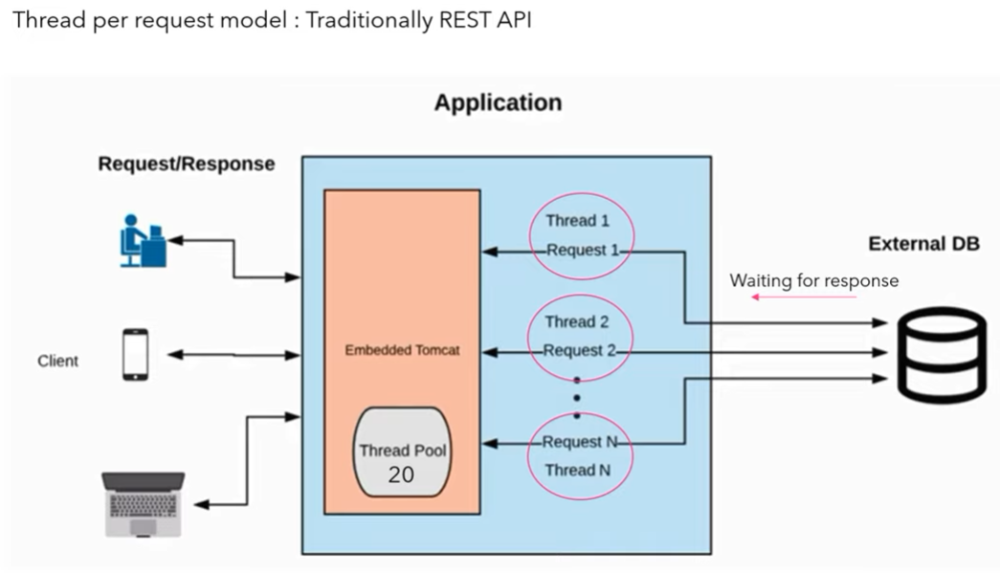

- [Rest API vs Reactive API](#rest-api-vs-reactive-api)
- [Reactive Microservices](#reactive-microservices)
  - [Responsiveness](#responsiveness)
  - [Resilient](#resilient)
  - [Elastic](#elastic)
  - [Message Driven](#message-driven)
- [Reactive Stream](#reactive-stream)
  - [Reactive Stream workflow](#reactive-stream-workflow)
    - [Steps](#steps)
  - [Implementations of Reactive Streams](#implementations-of-reactive-streams)
  - [Spring WebFlux](#spring-webflux)
    - [WebFlux vs MVC](#webflux-vs-mvc)
- [Mono and Flux](#mono-and-flux)
  - [Mono](#mono)
    - [Test](#test)
    - [Test with Exception](#test-with-exception)
  - [Flux](#flux)
    - [Test](#test-1)
    - [Test with Exception](#test-with-exception-1)
- [Code](#code)
  - [Controller](#controller)
  - [Service](#service)
  - [DAO](#dao)

# Rest API vs Reactive API

|REST API|Reactive API|
|--|--|
|||
|Synchonous & Blocking|Asynchronous & non-blocking|
|Server has 20 thread pools & all are serving 20 request(1 thread/request), 21st request has to wait till a thread is available from the pool|In Reactive programming, each thread receives request, delegates its backend(DB) operation, thread is released to handle other request. Once data is available from DB, available thread(need not be same thread which receives response) will handle it & respond back.  |
|Blue line in right is Rest API, won't get updated value once DB operation is performed. Client has to send new request to push latest DB data|<br/>Client can get newly inserted/updated record in DB from reactive DB since Client is subscribing event from application<br/> Eg: Live Cricket Score|
|Doesn't support backpressure|Supports backpressure<br/>|


# Reactive Microservices

https://suraj-batuwana.medium.com/reactive-microservices-with-spring-webflux-cf738600214

The Reactive definition says that qualities of Reactive Systems based on four principles: **Responsive, Resilient, Elastic and Message Driven.**

## Responsiveness

- Service should respond in a `timely manner, and never let clients or upstream services hang`

## Resilient

- When services stay responsive in the event of failure. By making use of replication, containment, isolation and delegation patterns, they ensure that **failures in one component do not affect another**
- It can respond because it can detect an async response is not coming back in time and serve up a degraded response (circuit breaker)

## Elastic

- Ability to **spin up new services**
- Downstream, upstream services and clients to find the new instances is vital to both the resilience of the system as well as the elasticity of the system

## Message Driven

- reactive services use asynchronous messaging at the boundaries between components, driving loose coupling, isolation and location transparency
- Non-blocking, asynchronous communication protocols allow systems to use resources only when there is something to be done.

# Reactive Stream

- The purpose of Reactive Streams is to provide a **standard for asynchronous stream processing with non-blocking back pressure.**
- While most of us familiar with the concept of stream processing, the **understanding of back pressure is essential to Reactive Streams**.
    -  When developing message driven systems, it is common to use a “push” relation between consumer and producer. The producer sends messages to the consumer as soon as they are available, and if the consumer is not able to process these messages in real time, these stored in a buffer. One point of concern with these types of systems is dealing with the excess amount of messages in the buffer when the producer is faster than the consumer
- In real world systems, neglecting this scenario often leads to slow response times for clients, excessive resource consumption, and even down times. **Back-pressure solves this by using a ‘pull’ relation between the producer and consumer. Now, the consumer informs the producer on how much data it can process, and the producer only sends the amount of data requested by the consumer**. Reactive Streams provides a standard interface for this relationship between consumers and producers of data.

## Reactive Stream workflow


### Steps

1. Subscriber(S) calls subscribe() method in Publisher(P)
2. P acknowledges S that its subscription is successful
3. S call request(n) in subscription interface. n - 'N' number of data
4. P sends data in onNext to S. If n(number of requested data) is 10, then 10 onNext called(1 OnNext for each data)
5. P acknowledge OnComplete() once all data is published (or) onError() in case of error.

In java reactive streams API consists of just four interfaces.

`Publisher`: A Publisher is the producer the of data, according to the demand requested by its subscribers.


`Subscriber`: The consumer of the data produced by a publisher.


`Subscription`: A subscription is the result of a Subscriber subscribing to a publisher. It is the means that a subscriber can utilise to request more data.


`Processor`: Represents a processing stage, being both a Subscriber and a Publisher, MUST obey the contracts of both


## Implementations of Reactive Streams
1. Akka Streams API
2. Pivotal’s Reactor project
3. Microsoft’s Reactive Extensions (RX)
4. Netflix’s RxJava
5. Eclipse’s Vert.x
6. Ratpack

## Spring WebFlux

Spring WebFlux internally uses **Pivotal’s Reactor project** and its publisher implementations are Flux and Mono.

A Mono, which will complete after emitting a single result.
A Flux, which will emit zero or multiple, possibly infinite, results and then completes.

### WebFlux vs MVC

|WebFlux|Spring MVC|
|--|--|
|support client-server architecture but there is a key difference in the concurrency model and the default behavior for blocking nature and threads|it is assumed that applications can block the current thread while in webflux, threads are non-blocking by default|


But need to remember that reactive and non-blocking generally do not make applications run faster. The **expected benefit of reactive and non-blocking is the ability to scale the application with a small, fixed number of threads and lesser memory requirements**. It makes applications **more resilient under load because they scale in a more predictable manner**.


But need to remember that reactive and non-blocking generally do not make applications run faster. The **expected benefit of reactive and non-blocking is the ability to scale the application with a small, fixed number of threads and lesser memory requirements**. It makes applications **more resilient under load because they scale in a more predictable manner**.


# Mono and Flux

Refer https://github.com/vinothg2309/Spring-boot/tree/main/Spring%20Reactive/spring-rest-reactive

## Mono

- **Returns 0 or 1 element.**
- A Mono object represents **a single or empty value**. This means it can emit **only one value at most for the onNext() request and then terminates with the onComplete() signal**. In case of failure, it only emits **a single onError() signal**.

```
Mono<String> helloMono = Mono.just("Hello");
    StepVerifier.create(helloMono)
      .expectNext("Hello")
      .expectComplete()
      .verify();
```

### Test
```
@Test
public void testMono() {
	Mono<String> monoTest =  Mono.just("Test").log();
	monoTest.subscribe(System.out::println);
}

logs:

18:34:26.361 [main] INFO reactor.Mono.Just.1 -- | onSubscribe([Synchronous Fuseable] Operators.ScalarSubscription)
18:34:26.365 [main] INFO reactor.Mono.Just.1 -- | request(unbounded)
18:34:26.365 [main] INFO reactor.Mono.Just.1 -- | onNext(Test)
Test
18:34:26.366 [main] INFO reactor.Mono.Just.1 -- | onComplete()

```
### Test with Exception

```
@Test
public void testMonoWithException() {
	Mono<?> monoTest =  Mono.just("Test")
			.then(Mono.error(new RuntimeException("Exception Occured")))
			.log();
	monoTest.subscribe(System.out::println);
}

logs:

18:37:39.108 [main] INFO reactor.Mono.Error.1 -- onSubscribe([Fuseable] Operators.EmptySubscription)
18:37:39.112 [main] INFO reactor.Mono.Error.1 -- request(unbounded)
18:37:39.114 [main] ERROR reactor.Mono.Error.1 -- onError(java.lang.RuntimeException: Exception Occured)
```

## Flux

- **Returns 0…N elements.**
- Flux is a standard Publisher that represents **0 to N asynchronous sequence values**. This means that it can **emit 0 to many values, possibly infinite values for onNext() requests**, and then terminates with either a completion or an error signal.
- Accepts **only list of object**

### Test
```
@Test
public void testFlux() {
	Flux<String> fluxObj = Flux.just("A", "B", "C").concatWithValues("D", "E").log();
	fluxObj.subscribe(System.out::println);
}

logs:

18:53:21.632 [main] INFO reactor.Flux.ConcatArray.1 -- onSubscribe(FluxConcatArray.ConcatArraySubscriber)
18:53:21.641 [main] INFO reactor.Flux.ConcatArray.1 -- request(unbounded)
18:53:21.642 [main] INFO reactor.Flux.ConcatArray.1 -- onNext(A)
A
18:53:21.643 [main] INFO reactor.Flux.ConcatArray.1 -- onNext(B)
B
18:53:21.644 [main] INFO reactor.Flux.ConcatArray.1 -- onNext(C)
C
18:53:21.644 [main] INFO reactor.Flux.ConcatArray.1 -- onNext(D)
D
18:53:21.644 [main] INFO reactor.Flux.ConcatArray.1 -- onNext(E)
E
18:53:21.645 [main] INFO reactor.Flux.ConcatArray.1 -- onComplete()
```

### Test with Exception

```
@Test
public void testFluxWithException() {
	Flux<?> fluxObj = Flux.just("A", "B", "C").concatWithValues("D", "E")
			.concatWith(Flux.error(new RuntimeException("Exception Occured")))
			.concatWithValues("F", "G")
			.log();
	fluxObj.subscribe(System.out::println);
}

logs:

19:02:20.248 [main] INFO reactor.Flux.ConcatArray.1 -- onSubscribe(FluxConcatArray.ConcatArraySubscriber)
19:02:20.253 [main] INFO reactor.Flux.ConcatArray.1 -- request(unbounded)
19:02:20.255 [main] INFO reactor.Flux.ConcatArray.1 -- onNext(A)
A
19:02:20.255 [main] INFO reactor.Flux.ConcatArray.1 -- onNext(B)
B
19:02:20.255 [main] INFO reactor.Flux.ConcatArray.1 -- onNext(C)
C
19:02:20.255 [main] INFO reactor.Flux.ConcatArray.1 -- onNext(D)
D
19:02:20.255 [main] INFO reactor.Flux.ConcatArray.1 -- onNext(E)
E
19:02:20.257 [main] ERROR reactor.Flux.ConcatArray.1 -- onError(java.lang.RuntimeException: Exception Occured)
	
```

# Code

customer-service - port: 3333
account-service - port: 4444

Customer - Account service API - http://localhost:3333/customer/<CUSTOMER_ID>/accounts

## Controller

Rest API - http://localhost:9000/customer/stream

```
@GetMapping("/{id}/accounts")
public Flux<Account> findByIdWithAccounts(@PathVariable("id") String id) {
    Flux<Account> accountList = webClientBuilder.build().get().uri("http://localhost:4444/account/customer/{customerId}", id)
            .retrieve().bodyToFlux(Account.class).log();
    return accountList;
}
```

## Service

```
public Flux<Customer> getAllCustomersStream() {
    long startTime = System.currentTimeMillis();
    Flux<Customer> customers = customerDao.getCustomersStream();
    long endTime = System.currentTimeMillis();
    System.out.println("Total Execution Time ---> "+ (endTime-startTime));
    return customers;
}
```

## DAO

```
public interface AccountRepository extends ReactiveCrudRepository<Account, String>{
	Flux<Account> findByCustomerId(String customerId);	
}
```